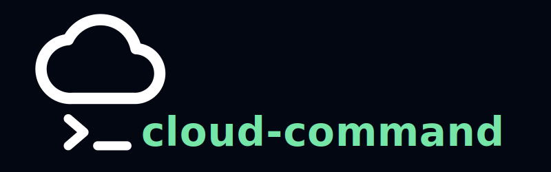
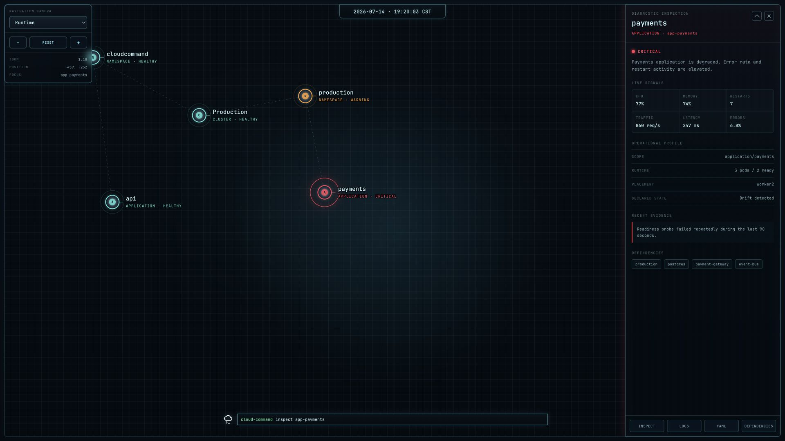

<p align="center">
  
</p>

<h1 align="center">CloudCommand</h1>

<p align="center">
  <strong>A single control plane for your entire Kubernetes fleet.</strong>
</p>

<p align="center">
  Public cloud · private cloud · on-premises · edge · homelab
</p>

> Kubernetes made a cluster declarative. CloudCommand makes a fleet of
> autonomous clusters declarative.

CloudCommand is being built to coordinate global intent, placement, policy,
evidence, approvals, provider execution, verification, rollback, and audit
across independent Kubernetes clusters—without stretching one cluster or trust
boundary across unreliable networks.

The project is an early working implementation and active systems-design
project. It is not production-ready.

## Control-plane interface



<p align="center"><em>Current spatial control-plane interface with the payments application in a critical state and its diagnostic inspection open. Displayed operational data is simulated.</em></p>

## The problem

Kubernetes standardizes orchestration inside a cluster. Operating a fleet still
requires teams to connect provider APIs, GitOps systems, policy, identity,
approvals, health evidence, incident response, and recovery workflows across
many independent failure domains.

CloudCommand's goal is to give an organization's SRE practice one control plane
across that fleet. It abstracts provider mechanics, not physical truth, and it
keeps the underlying systems visible to the operator.

It is not intended to be:

- a multi-kubeconfig wrapper
- a generic infrastructure dashboard
- one Kubernetes control plane stretched across distant sites
- a replacement for GitOps, CI/CD, or an organization's change process
- an AI agent with unrestricted provider credentials

## Fleet model

Each site retains an independent Kubernetes control plane, local reconciliation,
and its own failure boundary.

```text
Git: global desired intent
          |
CloudCommand: fleet policy, placement, governance, and recovery
          |
Independent Kubernetes clusters: local reconciliation and autonomy
          |
Workloads and local provider resources
```

A disconnected site continues running from its last accepted intent. When
connectivity returns, CloudCommand should discover the revision gap and perform
bounded, policy-controlled, auditable reconciliation.

Correctness means local convergence toward globally declared intent—not
instantaneous global consistency.

## Operational model

The target workflow separates observation, authorization, execution, and
verification:

```text
observe desired and current state
              |
produce evidence and a proposed plan
              |
evaluate deterministic policy and approval
              |
stage an immutable ChangeRequest
              |
customer-controlled GitOps / CI/CD executes
              |
verify health, retain rollback data, close audit
```

CloudCommand should not hold persistent fleet-wide administrative credentials.
The design favors scoped per-cluster identities, delegated RBAC, short-lived
credentials, outbound cluster-local agents, explicit blast-radius boundaries,
and customer-controlled execution.

## What exists today

| Area | Current state |
|---|---|
| Bootstrap CLI | Python bootstrap, status, doctor, local state initialization, and Kubernetes discovery |
| Kubernetes adapter | Node.js API for testing, registering, listing, and inspecting a Kubernetes provider through local kubeconfig or in-cluster identity |
| Provider UI | Browser workflow connected to the API for provider registration, discovery, and inspection |
| Spatial control plane | Interactive star map with pan, zoom, focus, status, console, and resource inspection |
| Reference environment | Reproducible Kubernetes lab guides and bootstrap scripts for commodity hardware and UTM virtual machines |
| Architecture | Provider interface, Resource Class, adaptive-control-plane, bootstrap, fleet, and safety design documentation |

The current implementation persists bootstrap and provider state in JSON. The
authoritative structured event stream, immutable audit model, approval routing,
outbound fleet agents, GitOps reconciliation, cross-cluster promotion, and
autopilot leases are design or roadmap work.

## Current implementation boundary

```text
cloudcommand.py
  └─ host checks, idempotent local bootstrap, kubectl discovery, JSON state

control-plane/api
  └─ Express API, Kubernetes client, provider registration and inspection

control-plane/web
  └─ API-connected provider workflow and operational views

control-plane/ui
  └─ primary spatial control-plane interface
```

CloudCommand currently supports one generic Kubernetes provider path. Managed
cloud lifecycle adapters, fleet reconciliation, service-class enforcement, and
multi-cluster workload movement have not yet been implemented.

## Run the control-plane interface

From the repository root:

```bash
python3 -m http.server 8080 --directory control-plane/ui
```

Then open:

```text
http://localhost:8080/
```

The interface is currently static and uses simulated operational data in some
views while the persisted control-plane event model is connected incrementally.

## Run the Kubernetes provider API

Requirements:

- Node.js and npm
- access to a safe Kubernetes test cluster
- a working local kubeconfig, or an in-cluster service identity

```bash
cd control-plane/api
npm install
npm start
```

The API listens on `http://localhost:3000` by default. Start with a lab or test
cluster; do not experiment on production.

See [CloudCommand provider setup](docs/cloudcommand-provider-setup.md) for the
current walkthrough.

## Repository map

```text
.
├── cloudcommand.py                 # early bootstrap agent and CLI
├── control-plane/
│   ├── api/                        # Kubernetes provider API
│   ├── ui/                         # primary spatial control-plane interface
│   └── web/                        # API-connected provider workflow
├── docs/                           # architecture, decisions, and lab guides
├── scripts/                        # Kubernetes bootstrap and node setup
└── README.md
```

## Design principles

- **Autonomous clusters.** A fleet is composed of independently failing and
  reconciling clusters, not one WAN-spanning Kubernetes control plane.
- **Desired state over imperative access.** Git carries versioned global intent;
  clusters converge locally as connectivity and policy allow.
- **Evidence before action.** Observe, validate, plan, approve, execute, verify,
  and audit as distinct lifecycle stages.
- **Provider independence with honest contracts.** Generic Kubernetes is the
  baseline. First-class adapters must prove provider-specific capabilities.
- **Least privilege.** CloudCommand initiates approved workflows through scoped
  identities rather than silently executing arbitrary privileged commands.
- **Local autonomy during partitions.** A disconnected site continues from its
  last accepted intent and reconciles safely on return.
- **Truthful interfaces.** The terminal, graphical views, alerts, and inspectors
  should eventually project the same authoritative structured events.
- **Progressive autonomy.** AI may explain and recommend; deterministic policy
  and explicit, expiring delegation govern execution.

## Near-term roadmap

The next milestone is one truthful operational loop from bootstrap through
inspection:

1. Define the structured event envelope, stable resource identifiers, deep
   links, persistence boundary, and immutable audit model.
2. Unify bootstrap and generic Kubernetes registration as one idempotent,
   restart-safe state machine with explicitly delegated authority.
3. Connect the console, graphical interface, and resource inspector to the same
   persisted live event model.

After that foundation is coherent, the roadmap expands to disconnect/reconnect
reconciliation, stateless workload promotion, cluster evacuation for
maintenance, one narrow stateful promotion contract, and additional provider
adapters.

See the [project roadmap](docs/roadmap.md) and
[architecture overview](docs/architecture.md) for the committed baseline. The
architecture is evolving, so documentation may distinguish current behavior,
accepted design decisions, experiments, and future work.

## Reference Kubernetes lab

The initial reference environment uses a base-model Apple M4 Mac Mini with
16 GB of memory, UTM virtual machines, Ubuntu Server, and Kubernetes to provide
a quiet, affordable, reproducible failure lab. The machine was acquired for
approximately USD 500 through Apple's education store; that is a historical
acquisition price rather than a claim about current retail pricing.

The hardware is not the product. The cluster is not the product. They are test
environments for proving provider discovery, desired-state reconciliation,
failure handling, and recovery behavior.

Follow [Create Your Own Kubernetes Cloud Provider on a Base-Model M4 Mac Mini](docs/utm-mac-mini-setup.md)
for the current lab guide.

The [reference lab architecture](docs/reference-lab.md) records the committed
upstream `kubeadm` baseline, workload-placement policy, public bootstrap plan,
physical-host expansion, and validation criteria. Hardware and memory choices
are tracked as explicit architecture decisions rather than undocumented buying
preferences.

## Project status

CloudCommand is under active development. Interfaces and domain models will
change as the first end-to-end vertical slice is built and verified.

Contributions should clearly state:

- the operational or architectural problem being addressed
- whether the change affects implemented behavior, the interface, or future design
- validation or test evidence
- documentation changes when behavior changes

## License

Licensed under the terms in [LICENSE](LICENSE).
