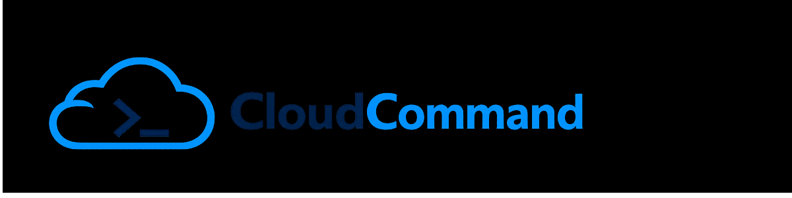
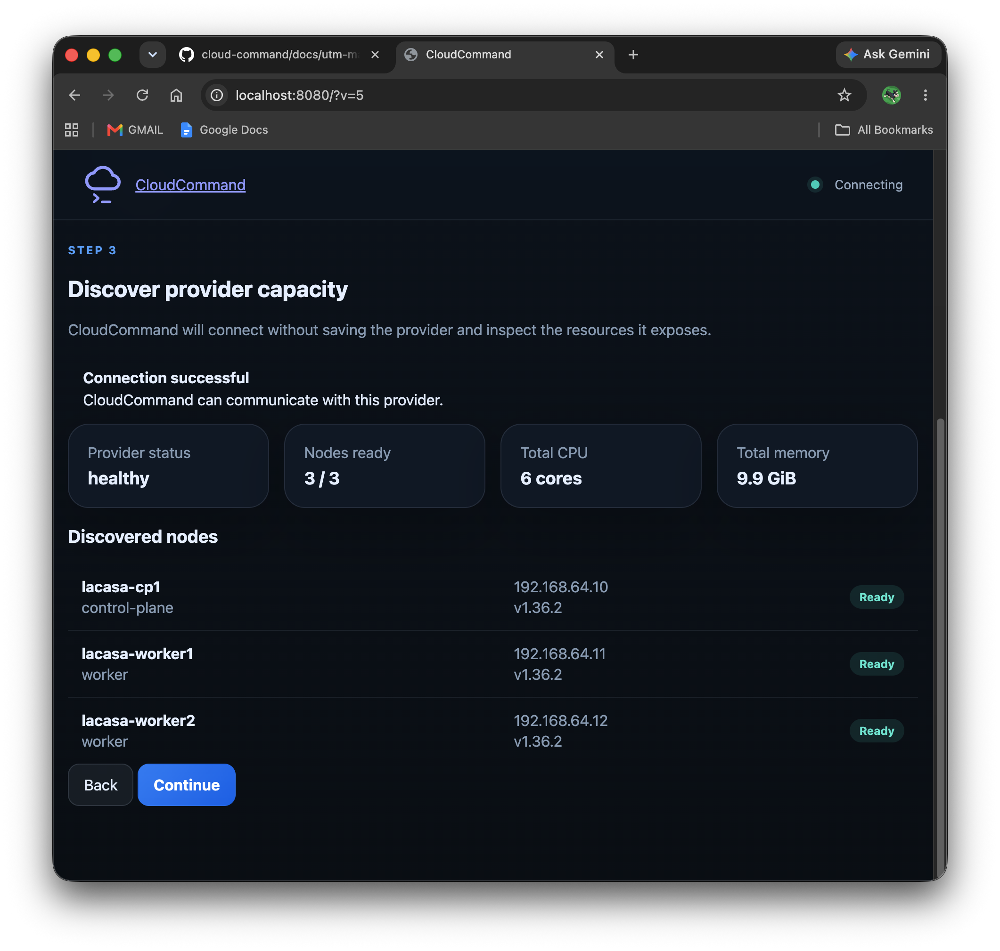

<p align="center">
  
</p>

# CloudCommand
## Screenshots

### Dashboard 



### Kubernetes Provider Registration


### Provider Discovery


**A provider-independent operations platform for deploying and managing workloads across heterogeneous infrastructure.**

CloudCommand provides a consistent operational interface for infrastructure that may be implemented using:

- Virtual machines
- Bare-metal systems
- Kubernetes clusters
- Public cloud services
- Private cloud infrastructure
- Future infrastructure providers

The central principle is simple:

> Applications should request capacity—not hardware.

Applications should not need to know whether their requested capacity is provided by a virtual machine, a Kubernetes cluster, a physical server, or a managed cloud service.

Those implementation details belong to the provider layer.

---

## Project Purpose

CloudCommand is an infrastructure operations platform designed to separate application requirements from infrastructure implementation.

Instead of requiring applications or operators to request specific machines, instance types, or hardware configurations, CloudCommand allows them to request standardized **Resource Classes**.

Infrastructure providers are then responsible for satisfying those requests.

This makes it possible to deploy workloads consistently across different environments without requiring the workload to understand the underlying infrastructure.

---

## Resource Model

The Resource Model is the foundation of CloudCommand.

Applications request **Resource Classes**.

Providers satisfy those Resource Classes.

Hardware is only one possible implementation.

### Resource Domains

#### Compute

- `C1`
- `C2`
- `C3`

#### Storage

- `S1`
- `S2`
- `S3`

#### Network

- `N1`
- `N2`
- `N3`

Resource Classes describe capabilities and service expectations rather than individual hardware components.

For example, an application might request:

```text
Compute: C2
Storage: S1
Network: N1
```

The provider determines how those requirements are implemented.

A `C2` compute request could potentially be satisfied by:

- A virtual machine
- A bare-metal node
- A Kubernetes worker
- An Amazon EC2 instance
- An Amazon EKS workload
- An Azure AKS workload
- A Google GKE workload
- Another compatible provider

The application does not need to change when the provider changes.

---

## Provider Architecture

CloudCommand treats infrastructure environments as providers.

A provider advertises the Resource Classes it can satisfy and exposes standardized operational capabilities to the platform.

Possible providers include:

- Local Kubernetes clusters
- On-premises virtualization
- Bare-metal infrastructure
- Amazon Web Services
- Microsoft Azure
- Google Cloud Platform
- Edge environments
- Development and testing environments

This architecture allows CloudCommand to provide one operational model across multiple infrastructure implementations.

---

## Operational Model

CloudCommand is intended to support the complete lifecycle of infrastructure capacity.

That lifecycle may include:

1. Discovering available infrastructure
2. Registering infrastructure with a provider
3. Validating provider capabilities
4. Assigning Resource Classes
5. Promoting capacity into production
6. Deploying workloads
7. Monitoring health and availability
8. Draining or demoting capacity
9. Removing failed or retired infrastructure

Operational procedures are designed to be implemented as standardized, auditable runbooks.

---

## Runbooks

Runbooks represent controlled operational actions.

Examples include:

- Add a node to a Kubernetes cluster
- Validate a newly discovered worker
- Promote a node into production
- Drain a node safely
- Demote a node from production
- Replace failed infrastructure
- Expand cluster capacity
- Validate provider health
- Deploy or roll back a workload

The long-term goal is to expose these runbooks through a simple operational interface while preserving the underlying engineering controls.

Every action should remain:

- Observable
- Repeatable
- Auditable
- Reversible when possible
- Independent of a specific infrastructure vendor

---

## Reference Environment

The initial reference environment uses a small on-premises Kubernetes cluster running on commodity hardware.

The first development environment is built using:

- A base-model Apple Mac Mini with Apple silicon
- UTM virtual machines
- Ubuntu Server
- Kubernetes
- Containerized workloads
- Standardized control-plane and worker-node roles

This environment serves as a reproducible provider implementation for developing and testing CloudCommand.

The Mac Mini is not the product.

The Kubernetes cluster is not the product.

They are reference implementations used to prove the provider model.

---

## Build the Reference Kubernetes Provider

To build the first CloudCommand Kubernetes environment on a base-model Apple Mac Mini, follow the complete setup guide:

### [Create Your Own Kubernetes Cloud Provider on a Base-Model M4 Mac Mini](docs/utm-mac-mini-setup.md)

The guide covers:

- Installing and configuring UTM
- Creating Ubuntu Server virtual machines
- Configuring the Kubernetes control plane
- Adding worker nodes
- Installing the container runtime
- Configuring cluster networking
- Validating the completed cluster
- Preparing the environment for CloudCommand

---

## Repository Structure

```text
.
├── .github/
│   └── workflows/
├── docs/
│   └── utm-mac-mini-setup.md
├── public/
├── src/
├── compose.yaml
├── Dockerfile
├── package.json
└── README.md
```

### Directory Overview

| Path | Purpose |
|---|---|
| `.github/workflows/` | Continuous integration and repository automation |
| `docs/` | Installation guides, architecture notes, and operational documentation |
| `public/` | Static web assets |
| `src/` | Application source code |
| `compose.yaml` | Local container orchestration |
| `Dockerfile` | Container image definition |
| `package.json` | Node.js project configuration |
| `README.md` | Project overview and entry point |

---

## Current Status

CloudCommand is under active development.

The current phase focuses on:

- Establishing the provider-independent architecture
- Defining the Resource Class model
- Building a reproducible Kubernetes reference provider
- Developing standardized operational runbooks
- Creating a functional operator interface
- Adding health, status, and observability capabilities
- Demonstrating infrastructure lifecycle management

The current repository should be treated as an early working implementation rather than a production-ready release.

---

## Design Principles

CloudCommand is being developed around the following principles:

### Provider Independence

Application workflows should not be tightly coupled to a particular infrastructure vendor or implementation.

### Capacity Over Hardware

Applications request capabilities and service levels rather than specific machines.

### Reproducibility

Infrastructure and operational procedures should be documented, automated, and repeatable.

### Observable Operations

Operational actions should produce clear status, logs, health information, and measurable outcomes.

### Controlled Change

Infrastructure changes should be performed through defined processes rather than undocumented manual intervention.

### Commodity Infrastructure

The platform should be capable of using affordable, widely available hardware where appropriate.

### Progressive Adoption

CloudCommand should be useful in a small local environment while remaining extensible to larger on-premises and public-cloud deployments.

---

## Project Vision

CloudCommand is intended to become a live operations platform capable of managing infrastructure through provider-independent workflows.

An operator should eventually be able to:

- View available capacity
- Inspect provider health
- Discover new infrastructure
- Validate candidate nodes
- Assign Resource Classes
- Promote or demote capacity
- Execute operational runbooks
- Deploy workloads
- Monitor services
- Respond to failures
- Expand the environment without redesigning the application layer

The same operational concepts should apply whether the underlying provider consists of three local Kubernetes nodes or a managed cloud platform.

---

## Contributing

This project is currently in an early development phase.

Documentation, architecture, provider interfaces, and runbook behavior may change as the reference implementation develops.

Issues and pull requests should include:

- A clear description of the proposed change
- The operational or architectural problem being addressed
- Testing or validation information
- Documentation updates when behavior changes

---

## License

This project is licensed under the terms included in the repository’s [`LICENSE`](LICENSE) file.
